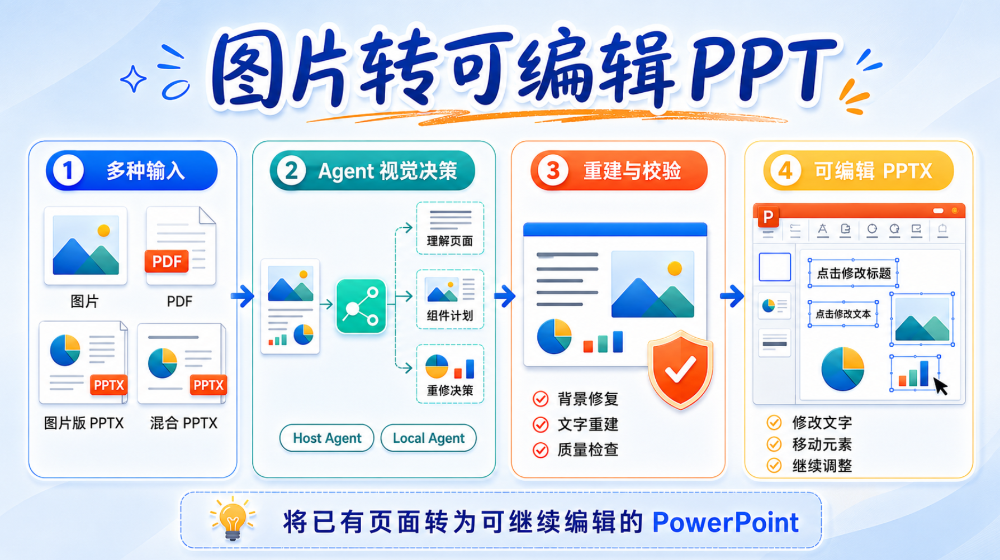

<div align="center">

# image2editable

中文 | [English](README_EN.md)

**图片、PDF、图片版 PPTX → 可编辑 PPTX**

[](https://www.python.org/)
[](LICENSE)
[]()

</div>



image2editable 用于把图片、PDF 和截图式 PPT 转换成可以继续修改的 PowerPoint。它适合课件截图、设计稿、报告页面和图片化幻灯片，减少从零复刻整页版式的工作。

转换后，可以直接在 PowerPoint 中修改识别出的文字、移动拆分出的视觉元素，并继续调整页面内容；处理混合 PPTX 时，原本可编辑的内容会保留在文件中。

---

## 转换效果演示：

|                             原图                             |                      转换后的可编辑效果                     |
| :----------------------------------------------------------: | :----------------------------------------------------------: |
|  |  |
|  |  |
|  |  |

**若是单独一张图片，为获得最佳的 16:9 PPT 视觉效果，建议输入图片采用 16:9 比例。**

## 特点

| 能力 | 说明 |
|------|------|
| 可编辑文字 | 尽量恢复为 PowerPoint 原生文本框，可在输出文件中直接修改。 |
| 可移动视觉元素 | 将可独立处理的视觉元素拆分为透明图片组件，便于移动或替换。 |
| 混合 PPTX 保护 | 未参与重建的原生文字、形状、表格、图表、备注和层级顺序保持不变。 |
| 多种输入 | 支持图片、图片目录、PDF、图片版 PPTX 和混合 PPTX。 |
| 批量转换 | 多张图片或多页文档按顺序生成多页 PPTX。 |
| 质量门禁 | 每页最多进行五轮重修，质量无改善时提前停止；只有通过质量门禁的重建结果才标记为可编辑转换完成。 |

## 使用前了解

- 这是把**已有页面**重建为可继续编辑 PPT 的工具，不是根据文章或大纲生成全新演示文稿。
- **⚠️ 复杂视觉元素通常会以可移动图片组件保留**，不能保证其内部元素都能恢复为原生 PowerPoint 形状。
- **🔒 Host Agent 模式可能把诊断图交由当前宿主服务处理**；处理敏感文件时，请选择 Local Agent。

## 快速上手

### 通过 **使用 skills CLI** 安装

```bash
npx skills add DSY-Xueai/image2editable --skill image-to-ppt
```

### **让 Agent 自动安装**

```bash
请从 https://github.com/DSY-Xueai/image2editable 安装 <image-to-ppt> skill。
```

安装后，可直接向支持视觉、文件读取和工具调用的 Agent 描述需求，Codex 中可使用 `$image-to-ppt`,claude code中可使用/image-to-ppt。图片、PDF 和 `.pptx` 可以直接粘贴或附加到对话框，也可以提供本地路径：

```text
#Codex
$image-to-ppt 把 input.pptx 转成可编辑 PPTX，保留没有命中的原生对象。
$image-to-ppt 把 input.png 转成可编辑 PPTX。
$image-to-ppt 把 <input.pdf> 转成可编辑 PPT。
#claude code
/image-to-ppt 把 input.pptx 转成可编辑 PPTX，保留没有命中的原生对象。
/image-to-ppt 把 input.png 转成可编辑 PPTX。
/image-to-ppt 把 <input.pdf> 转成可编辑 PPT。
```

**💡 建议：** 有可用的 Codex、Claude Code 等 AI 编程助手时优先使用 Skill；只想在本机离线处理图片或 PDF 时使用 Local CLI。

### Local CLI

先安装 Local CLI。需要完全离线运行时，可继续安装内置 Qwen；已有视觉模型服务时，也可以使用 OpenAI 兼容接口。

```bash
git clone https://github.com/DSY-Xueai/image2editable.git
cd image2editable
pip install .
```

#### 安装 OCR

完整转换需要至少一种 OCR。中文和复杂版面推荐 PaddleOCR；也可以使用 Tesseract。安装 OCR 后，继续安装下方运行时模型，再检查环境。

##### 方案一：PaddleOCR（推荐）

```bash
# 固定已验证的 CPU 路线；不需要配置 CUDA
python -m pip install "paddleocr==3.7.0" "paddlepaddle==3.3.1" "PaddleX==3.7.2" "PyYAML==6.0.2"
```

💡 PaddlePaddle GPU 版的安装方式可以查看[官方安装说明](https://www.paddlepaddle.org.cn/install/quick)。当前默认使用的是 CPU 版，不确定时直接按上面的命令安装即可。

##### 方案二：Tesseract

Tesseract 在 Windows、Linux 和 macOS 上的安装方法不同，先按照[官方安装说明](https://tesseract-ocr.github.io/tessdoc/Installation.html)安装主程序。

💡 也可以让 Codex、Claude Code 等编程助手检查操作系统和可用的包管理器，再根据 Tesseract 官方文档完成安装。

```bash
# 检查是否安装成功
tesseract --version
```

能正常显示版本号，再安装 Python 调用包：

```bash
python -m pip install pytesseract
```

#### 安装运行时模型

OCR 安装完成后运行：

```bash
image2editable models install runtime
```

该命令需要确认后才会下载固定版本的 SAM 2.1 Large、Big-LaMa 和 Grounding DINO，并校验下载结果、记录模型完整性；取消不会下载。

#### 检查环境 ✅

OCR 和运行时模型安装完成后，检查转换需要的 Python、OCR、模型文件、完整性记录和核心依赖：

```bash
image2editable doctor
```

输出中出现 `"ready": true`，就可以开始转换。

#### 可选：安装 Local Agent

需要使用随包 Local Agent 时，再执行：

```bash
python -m pip install ".[agent-local]"
image2editable models install agent
image2editable doctor --agent-local
```

模型安装命令同样需要确认；最后一条命令会额外验证 Local Agent 依赖和 Qwen 模型完整性记录。

检查通过后，使用内置 Qwen 转换：

```bash
image2editable convert input.pdf -o output.pptx --slide-size 16:9 --agent-provider local
```

#### 可选：配置本地模型服务

首次配置时，在项目根目录使用下面这个命令复制模板并**填写自己的服务信息**。

```powershell
Copy-Item .env.example .env
```

再编辑 `.env`：`IMAGE2EDITABLE_LOCAL_BASE_URL` 填**服务地址**，`IMAGE2EDITABLE_LOCAL_MODEL` 填**服务端实际暴露的模型名**；服务不需要密钥时让 `IMAGE2EDITABLE_LOCAL_API_KEY` 留空。

配置完成后，使用 `--agent-provider local-service` 调用本地服务：

```bash
# 图片 → 可编辑 PPTX
image2editable convert input.png -o output.pptx --slide-size 16:9 --agent-provider local-service

# PDF → 可编辑 PPTX
image2editable convert input.pdf -o output.pptx --slide-size 16:9 --agent-provider local-service
```

| 参数               | 默认值   | 用途                                                         |
| ------------------ | -------- | ------------------------------------------------------------ |
| `sources`          | 必填     | 要转换的输入：图片、图片目录、单个 PDF 或单个 PPTX。文档类输入不能与其他来源混用。 |
| `-o, --output`     | 输入同名 | 指定输出文件；`--slide-size both` 时用作输出基名。           |
| `--lang`           | `ch`     | 指定 OCR 识别语言，常用值为 `ch` 或 `en`。                   |
| `--agent-provider` | `host`   | 选择处理方式：`host` 交由当前 Agent/Skill 协作，`local` 使用已安装的 Qwen，`local-service` 使用 OpenAI 兼容的本地服务。 |
| `--slide-size`     | `both`   | 控制版式：`original` 保持输入比例，`16:9` 生成宽屏，`both` 同时生成两种尺寸。 |
| `--run-dir`        | 自动生成 | 指定运行目录，便于查看进度、继续未完成的任务或排查问题。     |

上面执行命令中的 `input.pdf` 就是 `sources`，等价于：

```test
sources = ["input.pdf"]
```

## 选择处理方式

| 方式 | 适合 | 工作方式 |
|------|--------|----------|
| Host Agent | 已在 Codex、Claude Code 等宿主中工作，并希望由 Agent 协助判断页面结构。 | Skill 将诊断资料交给当前宿主 Agent；**CLI 不会直接调用某个固定云端 AI API**。 |
| Local Agent | 已安装随包 Qwen，希望完全在自己的设备上处理。 | 使用固定版本和完整性凭据绑定的内置 Qwen，不回退到外部服务。 |
| Local Service | 已自行部署视觉模型服务。 | 使用 `local-service` 调用配置的 OpenAI 兼容接口，不回退到内置 Qwen 或 Host。 |

## 项目结构

```
image2editable/
├── .claude-plugin/            # Claude Code 插件清单
│   └── plugin.json
├── .github/                   # CI、Issue 表单和 PR 模板
├── docs/
│   └── images/                # README 图片资源
├── image2editable/            # 统一 CLI、运行时和转换模块
├── scripts/                   # 识别、重建和 PPTX/PSD 组装模块
├── skills/
│   ├── image-to-ppt/          # 可安装的图片转 PPT Skill
│   └── image-to-psd/          # 兼容的图片转 PSD Skill
├── tests/                     # 自动化测试
├── third_party/
│   └── licenses/              # 第三方许可证资料
├── .env.example               # Local Service 配置示例
├── .gitignore
├── CITATION.cff               # 引用信息
├── image_to_ppt.py            # 旧版图片专用技术路线，非当前推荐入口
├── image_to_psd.py            # 兼容的图片转 PSD 入口
├── LICENSE                    # MIT 许可证
├── pyproject.toml             # Python 包与 CLI 配置
├── README.md                  # 中文说明
├── README_EN.md               # English documentation
├── requirements.txt           # 核心依赖
└── THIRD_PARTY_NOTICES.md     # 第三方依赖与许可证说明
```

## 已知问题

- **⚠️ 复杂页面建议人工复核。** 艺术字、密集表格、渐变和复杂插画可能无法逐像素还原；请在交付前检查文字、组件位置和页面布局。
- 图片中的文字越清晰、背景越规整，重建通常越可靠；艺术字、密集表格、渐变和复杂插画不保证逐像素一致。
- **💳 Host Agent 会消耗模型的 Token / 上下文额度。** 复杂页面可能经过多轮诊断与重修，实际消耗取决于所用 Agent、模型和页面复杂度。Local 模式不使用项目方 Token，但会消耗用户本地模型服务的推理资源，CPU 可运行但速度可能较慢。
- **⏱️ 多页 PDF、复杂页面和高分辨率图片耗时较长。** 每页都会经过 OCR、视觉拆分、重建与质量检查，最多可进行 5 轮重修；Host 模式还需要等待 Agent 完成视觉判断。

## 支持的输入与常用选项

| 输入 | 使用建议 | 说明 |
|------|----------|------|
| 图片或图片目录 | Skill 或 Local CLI | 支持 PNG、JPG/JPEG、BMP、TIFF/TIF、WebP；目录只扫描第一层图片。 |
| PDF | Skill 或 Local CLI | 按页渲染并按顺序重建为多页 PPTX。 |
| 图片版 PPTX、混合 PPTX | 推荐 Skill | 会识别可处理的图片页；未命中的原生对象保持不变。 |

其他第三方依赖及许可证见 [THIRD_PARTY_NOTICES.md](THIRD_PARTY_NOTICES.md)，引用信息见 [CITATION.cff](CITATION.cff)。

## 许可证

MIT
