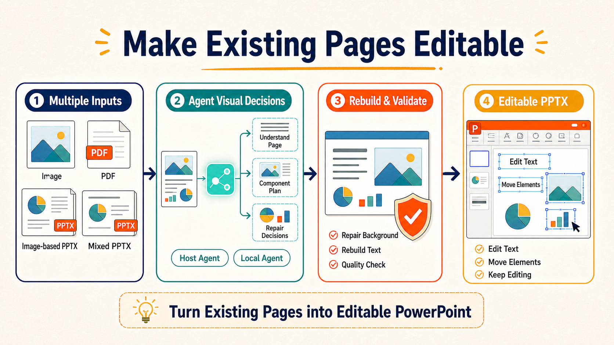
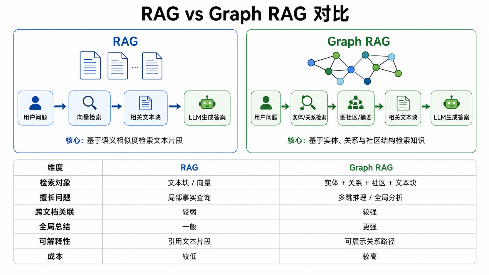
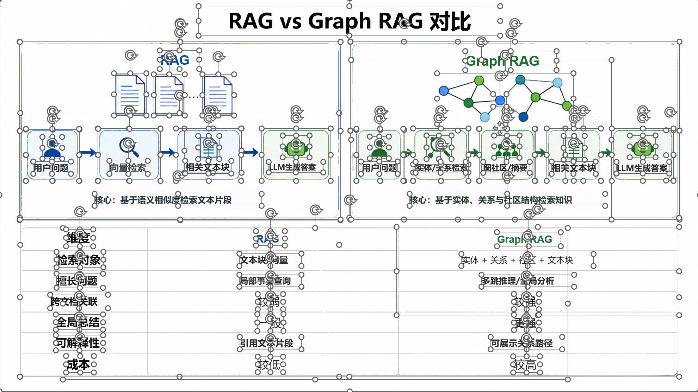
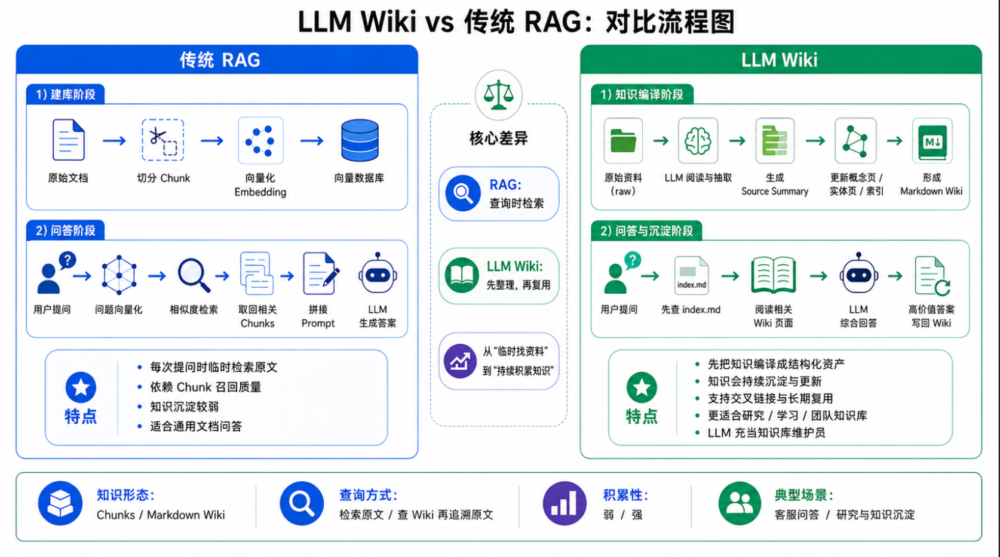
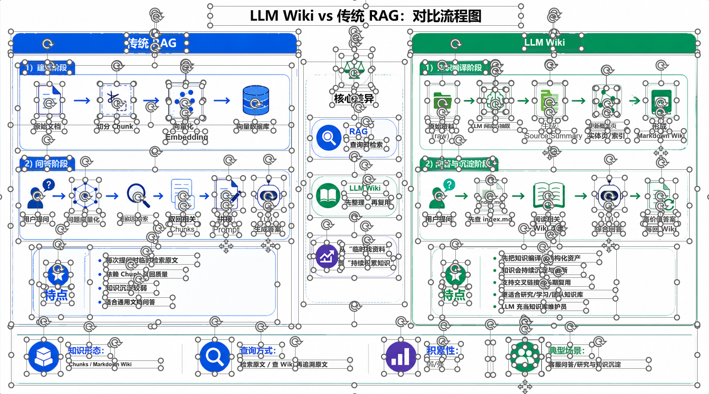
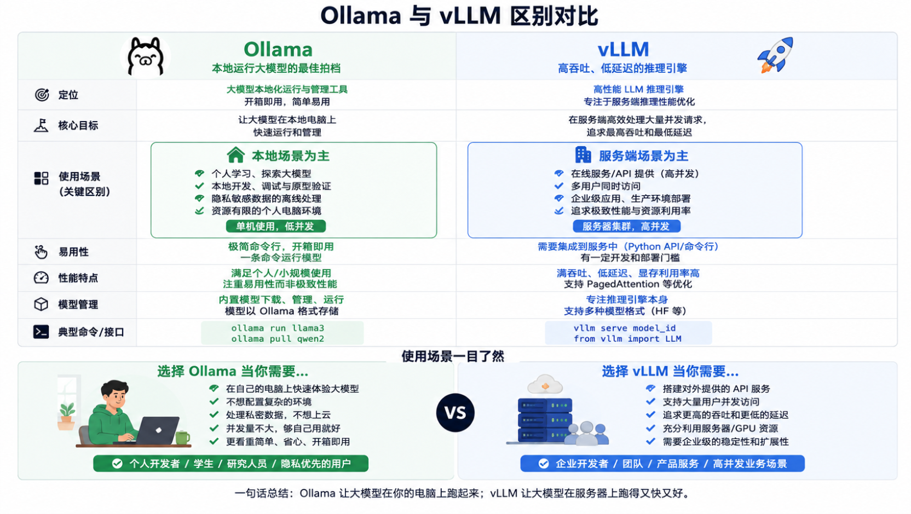
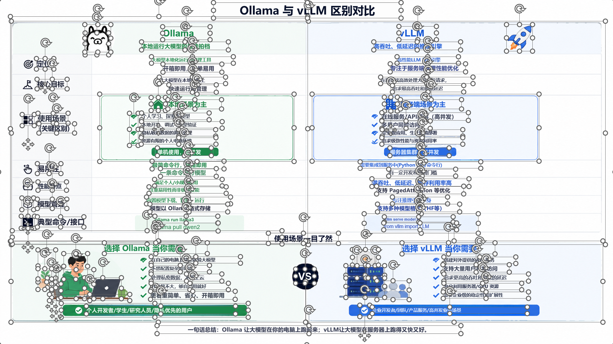

<div align="center">

# image2editable

[中文](README.md) | English

**Images, PDFs, and image-based PPTX → Editable PPTX**

[](https://www.python.org/)
[](LICENSE)
[]()

</div>



image2editable turns images, PDFs, and screenshot-based PowerPoint slides into PowerPoint files that can be edited again. It is designed for courseware screenshots, design mockups, report pages, and image-based slides, reducing the work of recreating a page from scratch.

After conversion, you can edit recovered text, move separated visual elements, and keep refining the page in PowerPoint. When processing a mixed PPTX, existing editable content is retained in the file.

---

## Conversion examples

| Source | Editable result |
| :----: | :-------------: |
|  |  |
|  |  |
|  |  |

**For the best visual result in a 16:9 PowerPoint deck, use a 16:9 input image when converting a single image.**

## Features

| Capability | What it does |
|------------|--------------|
| Editable text | Recovers readable text as native PowerPoint text boxes whenever possible. |
| Movable visual elements | Separates independently processable visuals into transparent image components that can be moved or replaced. |
| Mixed PPTX preservation | Native text, shapes, tables, charts, notes, and z-order that are not rebuilt remain unchanged. |
| Multiple inputs | Supports images, image directories, PDFs, image-based PPTX files, and mixed PPTX files. |
| Batch conversion | Converts multiple images or document pages into a multi-slide PPTX in order. |
| Quality gates | Makes up to five repair rounds per page and stops early when quality does not improve; only reconstructed results that pass the quality gates are marked complete as editable conversions. |

## Before you start

- This is a tool for rebuilding **existing pages** into editable PowerPoint files. It does not create a new presentation from an article or outline.
- **⚠️ Complex visuals are usually kept as movable image components.** Their internal elements are not guaranteed to become native PowerPoint shapes.
- **🔒 Host Agent mode may send diagnostic images to the current host service.** For sensitive files, use a local model service you control (`local-service`).

## Quick start

### Install with the **skills CLI**

```bash
npx skills add DSY-Xueai/image2editable --skill image-to-ppt
```

### **Let an Agent install it**

```text
Install the <image-to-ppt> skill from https://github.com/DSY-Xueai/image2editable.
```

After installation, describe the task to an Agent that supports vision, file access, and tool calls. Images, PDFs, and `.pptx` files can be pasted or attached in the chat, or provided as local paths:

```text
# Codex
$image-to-ppt Convert input.pptx to an editable PPTX and preserve native objects that are not selected for reconstruction.
$image-to-ppt Convert input.png to an editable PPTX.
$image-to-ppt Convert <input.pdf> to an editable PPTX.

# Claude Code
/image-to-ppt Convert input.pptx to an editable PPTX and preserve native objects that are not selected for reconstruction.
/image-to-ppt Convert input.png to an editable PPTX.
/image-to-ppt Convert <input.pdf> to an editable PPTX.
```

> **💡 Tip:** Use the Skill when an AI coding assistant such as Codex or Claude Code is available. Use Local CLI when images or PDFs need to stay on your own machine.

### Local CLI

Install the Local CLI first. The steps below prepare OCR, runtime models, and the local conversion environment; if you choose `local-service`, configure your own vision-model service as described below.

```bash
git clone https://github.com/DSY-Xueai/image2editable.git
cd image2editable
pip install .
```

#### Install OCR

A complete conversion needs at least one OCR engine. PaddleOCR is recommended for Chinese and complex layouts; Tesseract is also supported. After installing OCR, install the runtime models below, then check the environment.

##### Option 1: PaddleOCR (recommended)

```bash
# Use the verified pinned CPU route; no CUDA setup is needed for this option
python -m pip install "paddleocr==3.7.0" "paddlepaddle==3.3.1" "PaddleX==3.7.2" "PyYAML==6.0.2"
```

💡 See the [official installation guide](https://www.paddlepaddle.org.cn/install/quick) for PaddlePaddle GPU packages. The CPU build is the current default; use the command above if you are unsure.

##### Option 2: Tesseract

Tesseract installation differs on Windows, Linux, and macOS. First install the main program by following the [official instructions](https://tesseract-ocr.github.io/tessdoc/Installation.html).

💡 You can also ask Codex or Claude Code to check your operating system and available package manager, then complete the installation using the official Tesseract documentation.

```bash
# Check that Tesseract was installed successfully
tesseract --version
```

If the command prints a version number, install the Python package:

```bash
python -m pip install pytesseract
```

#### Install runtime models

After installing OCR, run:

```bash
image2editable models install runtime
```

The command asks for confirmation before downloading pinned versions of SAM 2.1 Large, Big-LaMa, and Grounding DINO and validating the local runtime receipt. Cancelling does not download anything.

#### Check the environment ✅

After installing OCR and the runtime models, check Python, OCR, model receipts, and the core dependencies:

```bash
image2editable doctor
```

You can start converting when the output contains `"ready": true`.

#### Configure a local model service

When using `local-service`, start your own vision-model service first. It must accept image input and return JSON through an OpenAI-compatible `/v1/chat/completions` endpoint.

For first-time setup, copy the template in the project root and **fill in your own service settings**.

```powershell
Copy-Item .env.example .env
```

Edit `.env`: set `IMAGE2EDITABLE_LOCAL_BASE_URL` to the **service address** and `IMAGE2EDITABLE_LOCAL_MODEL` to the **model name exposed by the service**. Leave `IMAGE2EDITABLE_LOCAL_API_KEY` empty when the service does not require a key.

After configuration, use `--agent-provider local-service` to call the local service:

```bash
# Image → editable PPTX
image2editable convert input.png -o output.pptx --slide-size 16:9 --agent-provider local-service

# PDF → editable PPTX
image2editable convert input.pdf -o output.pptx --slide-size 16:9 --agent-provider local-service
```

| Option | Default | Purpose |
|--------|---------|---------|
| `sources` | Required | Input to convert: image(s), an image directory, one PDF, or one PPTX. Document inputs cannot be mixed with other sources. |
| `-o, --output` | Derived from input name | Sets the output file. With `--slide-size both`, it is used as the output base name. |
| `--lang` | `ch` | OCR language; common values are `ch` and `en`. |
| `--agent-provider` | `host` | Selects the processing mode: `host` works with the current Agent/Skill, and `local-service` uses an OpenAI-compatible local service. |
| `--slide-size` | `both` | Selects output layout: `original` keeps the input ratio, `16:9` makes widescreen slides, and `both` creates both. |
| `--run-dir` | Generated automatically | Sets a run directory so you can inspect progress, resume an unfinished task, or troubleshoot. |

In the command above, `input.pdf` is `sources`, equivalent to:

```text
sources = ["input.pdf"]
```

## Choose a processing mode

| Mode | Best for | How it works |
|------|----------|--------------|
| Host Agent | Users already working in Codex, Claude Code, or a similar host and who want Agent assistance with page-structure decisions. | The Skill gives diagnostic material to the current host Agent; **the CLI does not call a fixed cloud AI API directly**. |
| Local Service | Users who already run their own vision-model service and want to process files on their own machine. | Uses `local-service` with the configured OpenAI-compatible API and never falls back to Host. |

## Project layout

```
image2editable/
├── .claude-plugin/            # Claude Code plugin manifest
│   └── plugin.json
├── .github/                   # CI, issue forms, and PR template
├── docs/
│   └── images/                # README image assets
├── image2editable/            # Unified CLI, runtime, and conversion modules
├── scripts/                   # Recognition, reconstruction, and PPTX/PSD assembly modules
├── skills/
│   ├── image-to-ppt/          # Installable image-to-PPT Skill
│   └── image-to-psd/          # Compatible image-to-PSD Skill
├── tests/                     # Automated tests
├── third_party/
│   └── licenses/              # Third-party license materials
├── .env.example               # Local Service configuration example
├── .gitignore
├── CITATION.cff               # Citation information
├── image_to_ppt.py            # Legacy image-only pipeline; not the recommended entry point
├── image_to_psd.py            # Compatible image-to-PSD entry point
├── LICENSE                    # MIT license
├── pyproject.toml             # Python package and CLI configuration
├── README.md                  # Chinese documentation
├── README_EN.md               # English documentation
├── requirements.txt           # Core dependencies
└── THIRD_PARTY_NOTICES.md     # Third-party dependency and license notices
```

## Known limitations

- **⚠️ Review complex pages manually.** Decorative text, dense tables, gradients, and complex illustrations may not be restored pixel for pixel. Check text, component positions, and layout before delivery.
- Clear text and regular backgrounds generally reconstruct more reliably. Decorative text, dense tables, gradients, and complex illustrations are not guaranteed to match pixel for pixel.
- **💳 Host Agent consumes the current model's token/context allowance.** Complex pages may require several diagnostic and repair rounds; actual usage depends on the Agent, model, and page complexity. Local Service does not use project tokens, but consumes inference resources from the local model service. CPU inference may be slow.
- **⏱️ Multi-page PDFs, complex pages, and high-resolution images take longer.** Each page goes through OCR, visual separation, reconstruction, and quality checks, with up to five repair rounds. Host mode also waits for Agent visual decisions.

## Supported inputs and common options

| Input | Recommended route | Notes |
|-------|-------------------|-------|
| Images or an image directory | Skill or Local CLI | PNG, JPG/JPEG, BMP, TIFF/TIF, and WebP are supported. Directories scan images in the first level only. |
| PDF | Skill or Local CLI | Pages are rendered and rebuilt into a multi-slide PPTX in order. |
| Image-based or mixed PPTX | Skill recommended | Processable image pages are selected for reconstruction; unmatched native objects stay unchanged. |

See [THIRD_PARTY_NOTICES.md](THIRD_PARTY_NOTICES.md) for third-party dependencies and licenses, and [CITATION.cff](CITATION.cff) for citation information.

## License

MIT
