# 适用于网页版的图片转可编辑PPT转换方法

原理：将每张图片的视觉元素拆分成独立的图片，文字拆分成可编辑文本框

以下示例使用的是ChatGPT网页版，模型选择 5.6 High

耗时与图片复杂度有关，测试了很多张，基本都在10分钟内

保姆级教程在网页转换示例下方

仓库右上角点个star，感谢支持哟

## 网页转换示例

|                             原图                             |                       转换后可编辑效果                       |                          耗时与过程                          |
| :----------------------------------------------------------: | :----------------------------------------------------------: | :----------------------------------------------------------: |
| 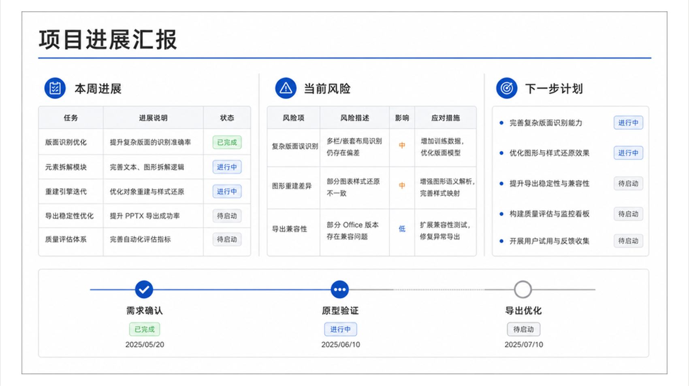 | 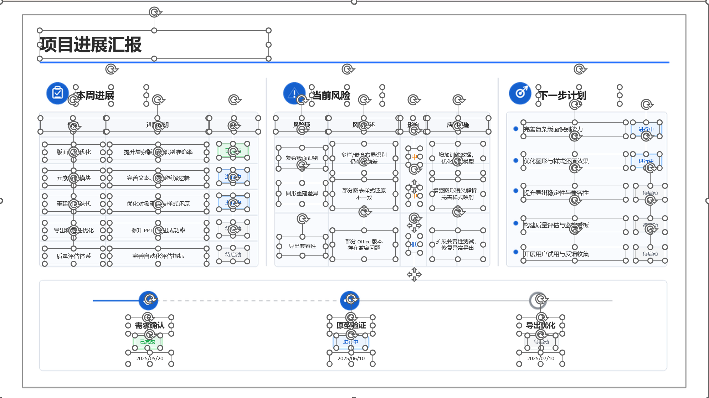 | 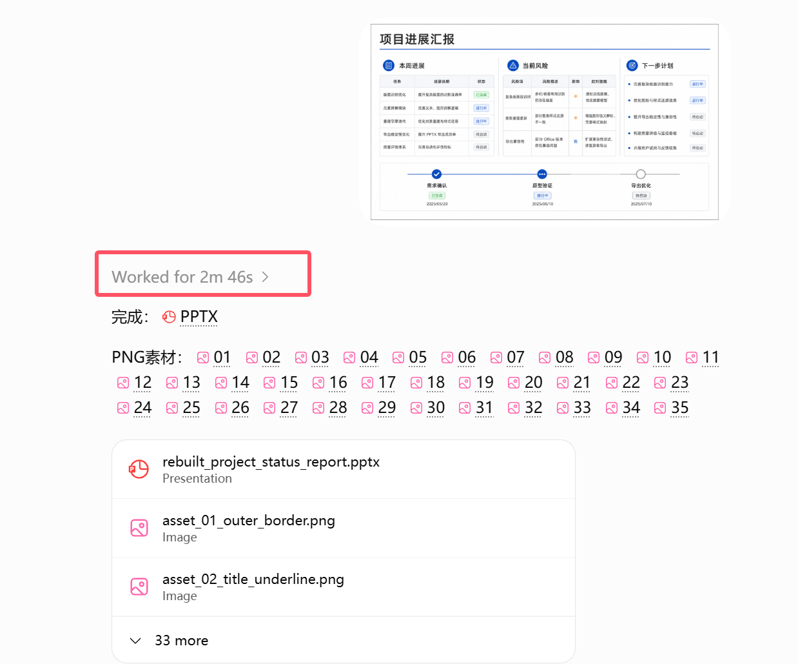 |
|  | 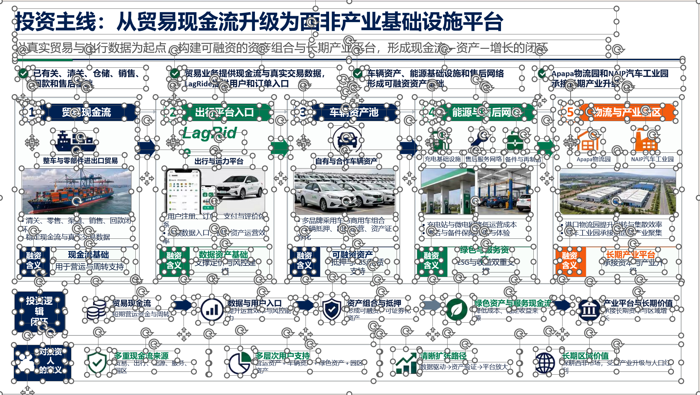 | 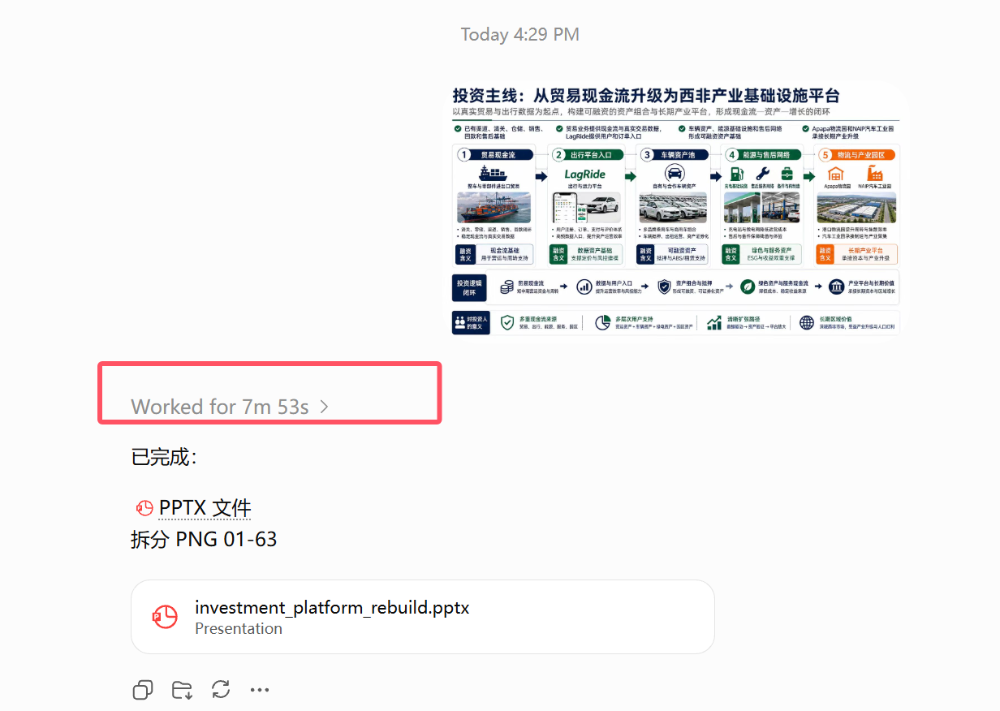 |
| 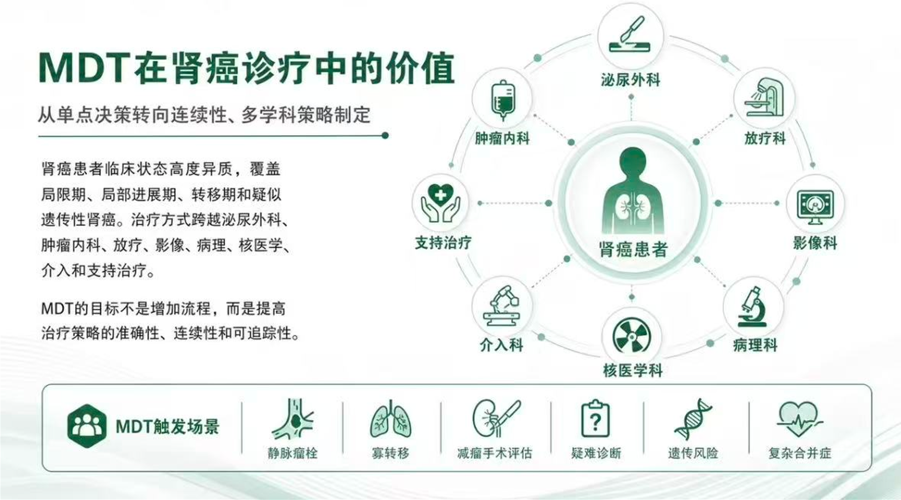 | 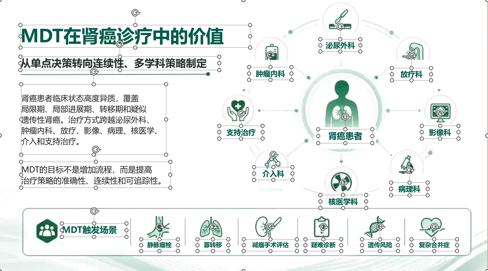 | 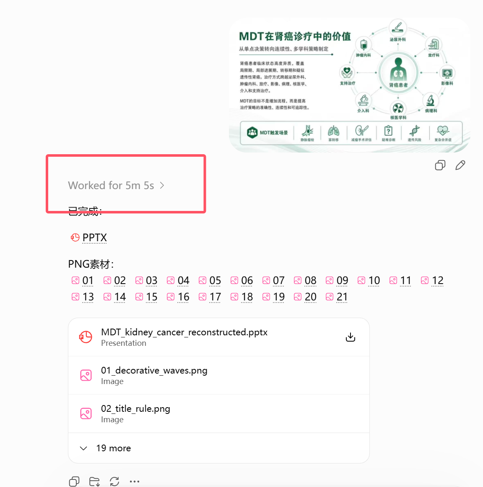 |

------

## 保姆教程

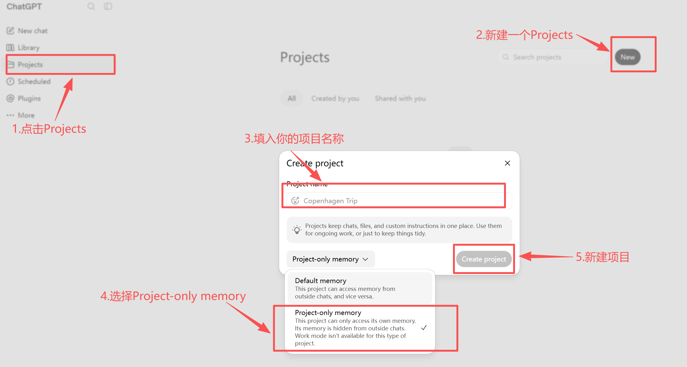

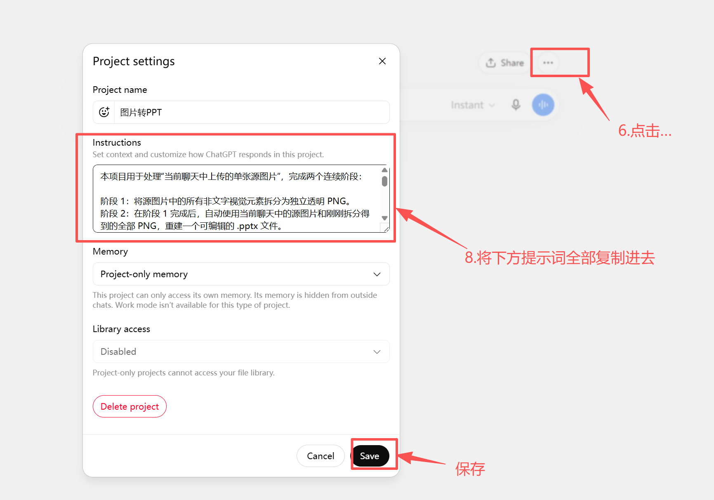

**提示词下面还有些说明，建议看完**

------

```markdown
本项目用于将当前聊天直接上传的单张图片拆分为独立视觉素材，并自动重建为可编辑PPTX。

新聊天中仅上传1张图片时，直接执行完整流程：
阶段1：拆分全部非文字视觉元素
阶段2：使用全部拆分素材重建可编辑PPT

不进行确认，不要求重复输入提示词，不等待“继续”，直接执行。

====================

一、任务隔离
====================

每个聊天只处理当前聊天直接上传的源图片。

禁止使用、引用、混入或复用其他聊天中的：
-源图片
-PNG素材
-PPT
-视觉元素
-处理结果

1张源图片对应1个独立聊天任务。

====================

二、阶段1核心原则
====================

阶段1的目标是“对象级视觉分离”，不是区域裁剪。

必须优先使用当前ChatGPT会话原生提供的图像理解和图像编辑能力，逐个提取独立视觉对象。

禁止使用Python、OpenCV、Pillow或其他代码根据目测坐标生成以下内容作为最终对象Mask：
-矩形
-多边形
-椭圆
-自由几何区域
-bounding box
-套索区域
-人工坐标轮廓

禁止：
-矩形裁剪代替抠图
-多边形裁剪代替抠图
-大块区域裁剪
-将区域外设透明后冒充对象分离
-截图代替独立素材
-多个对象合并输出

Python仅允许用于：
-读取图片尺寸
-读取Alpha通道
-计算透明边界
-坐标换算
-文件处理
-质量分析
-PPTX生成

Python不得根据目测轮廓制造人物或物体的最终透明Mask。

如果当前原生图像编辑能力无法得到合格对象，不得退化为矩形、多边形或粗略区域裁剪继续制作PPT。

====================

三、识别全部视觉对象
====================

先完整分析源图，识别全部具有独立素材意义的非文字视觉对象。

包括但不限于：
-每一个独立人物
-独立物品
-独立装饰图形
-问号
-符号
-图标
-卷轴
-牌子
-标签框
-气泡
-边框
-插画装饰
-其他独立图形
-完整背景场景层

人物即使互相接触、重叠或遮挡，也必须视为不同实例。

不得因为对象距离近而合并。

不得为了减少素材数量扩大拆分范围。

不得把一个完整对象无意义拆成多个碎片。

标题、正文、数字、标签、说明文字等普通排版文字不作为PNG素材。

====================

四、逐对象提取
====================

每次只处理一个目标对象。

对每个目标对象使用原生图像编辑能力执行对象级提取。

要求：
-仅保留当前目标对象
-移除其他人物
-移除其他物体
-移除背景
-移除普通排版文字
-输出真实透明背景
-保持目标对象外观尽可能与源图一致

必须尽量保持：
-颜色
-比例
-方向
-表情
-服装
-发型
-线条
-纹理
-原画风格
-可见细节

不得因为对象提取困难，把目标对象和相邻人物、物品或背景一起保留。

====================

五、遮挡规则
====================

对象被其他对象遮挡时，只保留源图中真实可见的部分。

例如儿童站在成人前方时：
-成人PNG不得包含儿童
-儿童PNG不得包含成人残片
-不得为了得到完整成人而虚构被遮挡身体

不得擅自生成源图中不存在的被遮挡区域。

PPT阶段按照源图真实前后关系恢复遮挡层级。

====================

六、对象边缘
====================

透明PNG边缘必须沿对象真实视觉轮廓。

必须尽可能保留属于对象本身的：
-头发
-发梢
-手指
-帽檐
-衣服边缘
-鞋子
-描边
-阴影
-光晕
-柔边
-半透明边缘

出现以下任一情况即判定提取失败：
-水平直线切边
-垂直直线切边
-斜直线切边
-三角形切边
-多边形边界
-矩形边界
-明显几何缺口
-人物身体被直线截断
-背景块跟随对象
-相邻人物混入
-其他物品混入
-真实轮廓明显缺失
-明显错误透明
-明显对象残片

失败后必须重新使用原生图像编辑能力提取当前对象。

禁止使用Polygon、矩形、PPT裁剪或遮罩修补失败结果。

====================

七、独立性与唯一性
====================

每张PNG只能包含一个独立视觉对象。

同一个人物或物体不得重复出现在多个PNG中。

完成全部前景对象后必须检查：
-是否同一人物出现在多个PNG
-人物A的PNG是否包含人物B
-不同PNG是否存在明显重复对象
-是否有其他对象残片

发现重复、粘连或误包含时，必须重新处理相关对象。

不得通过PPT前后层级隐藏重复对象。

====================

八、PNG规格
====================

阶段1每张PNG使用与源图片完全相同的画布尺寸。

保持对象：
-原始坐标
-原始尺寸
-原始比例
-原始方向

除当前对象外，其余区域全部透明。

禁止：
-自动居中
-缩放
-拉伸
-改变比例
-改变方向
-改变对象位置

如果原生图像编辑结果为tight crop：
必须保持对象本身比例和尺寸关系，并根据其在源图中的真实位置放回与源图同尺寸的透明画布。

====================

九、文字承载图形
====================

卷轴、牌子、标签框、气泡等“图形+文字”结构必须将图形和普通文字分离。

图形作为独立视觉素材保留。

普通文字在PNG中移除，在PPT阶段重建为可编辑文本。

移除文字时必须保持图形本体完整。

只允许使用原生图像编辑能力修复文字原本覆盖的图形区域。

禁止因为移除文字而：
-删除图形
-裁断图形
-只保留图形残片
-破坏图形边缘
-改变图形结构

====================

十、背景
====================

背景作为完整场景层单独处理。

不得将背景拆成无意义的小块。

全部前景对象完成后，生成无前景对象、无普通文字的完整干净背景。

前景对象或文字原本遮挡的背景区域，可使用原生图像编辑能力进行背景修复。

源图中原本可见的背景区域必须尽可能保持不变。

禁止使用：
-纯色背景替代原背景
-大块色块替代
-拉伸背景
-镜像背景
-邻近像素扩张
-三角形填充
-多边形扩散
-放射状填充
-简单模糊覆盖
-大块渐变填充

背景不得出现：
-空洞
-几何拼接边
-放射状痕迹
-明显重复纹理
-大块模糊
-明显修复痕迹

====================

十一、逐对象视觉验收
====================

每个对象提取完成后必须立即检查。

将透明PNG置于棋盘格或高对比背景上检查。

逐张确认：
-只有目标对象
-无其他人物
-无其他物品
-无背景
-无几何切边
-无身体截断
-无缺边
-无残片
-无错误透明
-阴影、光晕、柔边未被错误删除
-对象没有明显重绘或变形
-颜色、服装、表情、比例没有明显变化

任一项不合格：
重新使用原生图像编辑能力处理当前对象。

不得使用Python几何Mask返修。

====================

十二、反向合成验收
====================

全部视觉对象完成后，将：

完整背景
+
全部独立PNG

按照源图原始坐标和原始前后层级重新叠加。

生成重建预览并与源图比较。

必须检查：
-人物是否完整
-是否有人物重复
-是否有其他人物残片
-是否有背景残片
-是否存在空洞
-是否有几何切边
-是否遗漏视觉对象
-是否遗漏小型装饰元素
-对象层级是否正确
-背景是否自然
-整体构图是否接近源图

发现问题必须返回对应对象重新处理。

只有逐对象视觉验收和反向合成验收全部通过，阶段1才算完成。

====================

十三、阶段1输出
====================

必须逐张输出全部独立PNG。

禁止：
-ZIP
-压缩包
-文件夹代替逐张输出
-拼图
-九宫格
-Sprite Sheet
-素材合集
-多个对象合并输出

阶段1全部完成后立即继续阶段2。

====================

十四、阶段2：重建可编辑PPT
====================

PPT中的实际非文字视觉素材只能使用阶段1验收通过的独立PNG。

源图片仅用于：
-读取文字
-确认原始布局
-确认坐标
-确认层级
-最终视觉校验

禁止：
-将源图整页插入PPT
-将源图作为背景兜底
-从源图重新裁剪大块区域
-使用大块截图代替独立PNG
-把多个PNG重新合并成一张图片
-使用白块遮盖错误
-使用PPT裁剪隐藏错误
-使用遮罩隐藏阶段1错误

如果PPT阶段发现某个PNG存在问题，必须返回阶段1重新处理。

====================

十五、PNG进入PPT
====================

阶段1全部独立PNG都必须用于PPT，不得遗漏。

每个视觉对象在PPT中必须保持为独立图片对象。

阶段1PNG使用完整源图画布，仅用于保留原始坐标。

进入PPT前，必须根据Alpha通道计算每张PNG实际非透明边界。

根据该边界：
1.裁掉四周无内容透明区域
2.生成tight透明PNG
3.保持对象像素、比例、方向不变
4.根据原始非透明边界坐标放回PPT对应位置

不得裁掉：
-真实边缘
-阴影
-光晕
-柔边
-半透明像素

位置计算：

PPT_X=元素左边界X/源图宽度×PPT页面宽度
PPT_Y=元素上边界Y/源图高度×PPT页面高度
PPT_Width=元素边界宽度/源图宽度×PPT页面宽度
PPT_Height=元素边界高度/源图高度×PPT页面高度

禁止通过目测重新摆放。

禁止为了缩小框选范围改变对象原始比例或大小关系。

恢复源图前后层级。

PowerPoint中单击任意视觉元素时，其图片框必须贴合对象实际边界，不得接近整张幻灯片大小。

====================

十六、文字重建
====================

所有普通排版文字必须重新建立为可编辑文本框。

不得把普通文字制作成图片。

不得遗漏文字。

不得在PNG和文本框中重复同一普通文字。

文字识别和字体还原必须分别处理：
-先准确识别文字内容
-再独立分析字体和字形
-不得因为OCR结果正确就直接使用默认字体
-不得因为无法立即确认字体名称就随意使用常见字体、默认字体或明显不匹配字体完成重建

字体还原必须重点比较源图中的：
-汉字笔画结构
-横竖粗细关系
-撇捺形态
-点画形态
-转角形态
-圆角程度
-字面宽窄
-字身高宽比
-字腔大小
-字重
-重心
-字间视觉密度
-数字和英文字形
-标点形态

必须优先寻找与源图字形特征高度一致的字体。

不得仅因为字体名称不确定就降低字体匹配标准。

字体名称无法直接确认时，必须继续比较可用候选字体的实际字形表现，以最终渲染字形与源图的视觉接近程度为判断依据。

不得统一使用默认字体。

不得为了快速完成而整页统一成同一种字体。

同一页面不同文字区域如果源图字体不同，必须分别识别和还原。

尽可能还原：
-文字内容
-字体
-字号
-字重
-字形风格
-颜色
-对齐
-行距
-字距
-位置
-方向
-旋转
-文本框尺寸
-换行
-描边
-阴影
-发光
-透明度
-渐变
-多色文字
-艺术字效果
-手写字
-卡通字
-圆角字

每一处源图普通文字默认只能对应一套实际文字内容。

禁止为了模拟以下效果而复制相同文字并在相同或近似位置重复叠加：
-加粗
-伪粗体
-描边
-外轮廓
-阴影
-发光
-立体感
-颜色加深
-字体不匹配补偿
-文字宽度补偿
-视觉加粗补偿

文字的描边、阴影、发光、透明度、填充、渐变等效果必须优先直接应用在同一个可编辑文字对象或对应文字区段上。

禁止使用两个或多个内容完全相同的文本框重合叠放来冒充单个文字效果。

禁止使用同样文字轻微错位叠加来模拟描边或阴影。

禁止因为字体不够接近而复制同一文字多层叠加改善视觉效果。

只有当源图本身明确存在可见的双层文字、重影文字、错位印刷文字或独立多层艺术字设计时，才允许建立多个文字层。

源图确实存在多层文字效果时：
-必须先确认源图确实存在多个独立文字视觉层
-每层必须对应源图真实存在的效果
-不得增加源图不存在的重复文字层
-不得让多个完全相同的文字层无差别重合
-必须保持各层真实偏移、颜色、透明度和前后关系

同一文本框内部存在多种颜色、字号、字体、字重或效果时，按对应字符或文字区段分别还原。

文字必须可以直接编辑。

文字完成后必须进行逐区域渲染比对。

必须检查：
-文字内容是否正确
-字体字形是否接近源图
-是否误用了默认字体
-字号是否正确
-字宽和字高是否接近
-字重是否接近
-字距是否接近
-行距是否接近
-换行是否一致
-文本框位置是否一致
-文本框尺寸是否合理
-颜色是否一致
-描边是否一致
-阴影是否一致
-是否存在相同文字重复叠加
-是否存在为了模拟效果而建立的无意义重复文本框

如果字体形态、排版或文字效果与源图存在明显差异，必须继续调整，不得因为文字内容正确就判定通过。

如果发现相同文字在同一位置或近似位置出现两次以上，而源图并不存在真实多层文字设计，必须删除重复文字层并重新实现文字效果。

====================

十七、最终验收
====================

正式输出PPT前必须检查：

1.全部非文字视觉对象均已拆分
2.阶段1全部PNG均已用于PPT
3.每张PNG只有一个独立对象
4.无人物粘连
5.无对象重复
6.无背景残留
7.无矩形、多边形或直线切边
8.无缺边或截断
9.无遗漏小型装饰元素
10.无整页源图
11.无大块截图
12.PNG位置正确
13.PNG尺寸和比例正确
14.PNG层级正确
15.图片框贴合对象真实边界
16.普通文字全部为可编辑文本
17.无文字重复
18.文字字体、字号、颜色、位置和效果尽量接近源图
19.背景完整自然
20.页面整体视觉效果尽量接近源图
21.PPT可以正常打开和编辑
22.不得存在源图没有的相同文字重叠层
23.不得通过复制同一文字模拟描边、阴影、发光、加粗或字体补偿
24.每处文字字体必须依据源图实际字形进行匹配，不得直接使用默认字体或明显不匹配字体
25.文字最终验收必须同时比较文字内容和字形外观，不得只检查OCR内容是否正确

发现任何问题必须先修复，再输出。

====================

十八、禁止降级策略
====================

对象提取失败时，禁止改用：
-矩形裁剪
-多边形裁剪
-更复杂的Polygon
-Python手绘Mask
-bounding box
-大块源图
-截图拼接
-多个相邻人物合并
-纯色背景
-PPT白块
-PPT遮罩
-PPT裁剪

不得为了完成任务而提交明显错误的粗略拆分结果。

====================

十九、最终交付
====================

最终必须实际创建并交付：

1.全部独立透明PNG
2.一个可正常打开和编辑的.pptx文件

不得只提供：
-处理计划
-元素清单
-代码
-说明
-步骤
-完成声明


```

------

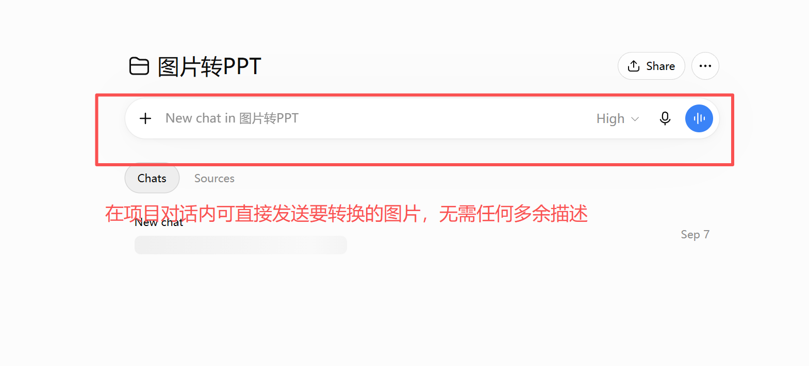

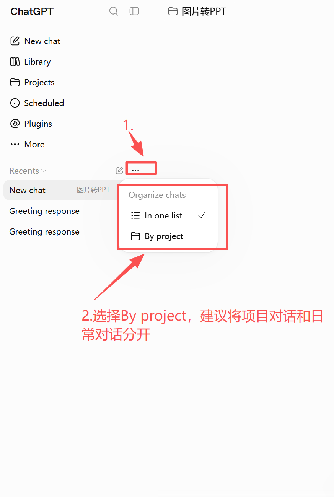

### 常问问题：

1. **为什么只建议一张图片一个 Chat？**
    因为要求“完整拆分所有元素 + 后续精准重建 PPT”。一张图一个 Chat 能避免不同页面的素材、坐标、文字、图层互相混淆，稳定性最高。
2. **为什么不建议一次发多张？**
    不是绝对不能，而是一次多张会同时带来：

​	1.元素数量暴增，容易漏拆或合并错元素；

​	2.不同图片的素材容易串页；

​	3.单次生成/处理数量存在限制；

​	4.后续很难保证“哪个 PNG 属于哪一页、哪个坐标”。

# English Version

## Method for Converting Images into Editable PowerPoint Presentations on the Web

Principle: split every independent non-text visual element in the source image into its own PNG asset, then rebuild all ordinary text as editable text boxes.

This workflow is for the ChatGPT web interface. Select the 5.6 High model. Processing time depends on image complexity; current tests generally finish within 10 minutes. The tutorial appears below the web conversion examples.

## Web Conversion Examples

| Original image | Editable result | Time and process |
| :---: | :---: | :---: |
|  |  |  |
|  |  |  |
|  |  |  |
------

## Tutorial


**The notes below the prompt are also important; please read them.**

------

## Complete Prompt

```markdown
This project converts one source image uploaded directly in the current chat into independent visual assets and automatically rebuilds an editable PPTX.

When a new chat contains exactly one uploaded image, execute the complete workflow immediately:
Stage 1: separate every non-text visual element.
Stage 2: use every separated asset to rebuild an editable PowerPoint presentation.

Do not ask for confirmation, request the prompt again, or wait for ?continue?. Execute directly.

====================
I. TASK ISOLATION
====================

Process only the source image uploaded directly in the current chat.

Never use, reference, mix, or reuse any of the following from another chat:
- Source images
- PNG assets
- PPT files
- Visual elements
- Processing results

One source image is one independent chat task.

====================
II. STAGE 1 CORE PRINCIPLES
====================

Stage 1 aims for object-level visual separation, not region cropping.

Prioritize the native image understanding and image editing capabilities available in the current ChatGPT session to extract independent visual objects one at a time.

Do not use Python, OpenCV, Pillow, or other code to generate any of the following from visually estimated coordinates as the final object mask:
- Rectangles
- Polygons
- Ellipses
- Arbitrary geometric regions
- Bounding boxes
- Lasso regions
- Manually defined coordinate contours

Do not:
- Substitute rectangular or polygonal crops for object extraction
- Crop large regions
- Make everything outside a region transparent and present it as object separation
- Substitute screenshots for independent assets
- Combine multiple objects in one output

Python is allowed only for:
- Reading image dimensions
- Reading alpha channels
- Calculating transparency bounds
- Converting coordinates
- Handling files
- Analyzing quality
- Generating PPTX files

Do not use Python to create the final transparency mask for a person or object from a visually estimated contour.

If native image editing cannot produce an acceptable object, do not fall back to rectangular, polygonal, or rough region crops to continue making the PPT.

====================
III. IDENTIFY EVERY VISUAL OBJECT
====================

First analyze the entire source image and identify every non-text visual object that can serve as an independent asset.

Include, but do not limit the scope to:
- Each individual person
- Individual items
- Independent decorative graphics
- Question marks
- Symbols
- Icons
- Scrolls
- Signs
- Label frames
- Speech bubbles
- Borders
- Illustrated decorations
- Other independent graphics
- The complete background scene layer

Treat people as separate instances even when they touch, overlap, or occlude one another.

Do not merge objects because they are close together. Do not expand the separation unit to reduce the asset count, or split an intact object into meaningless fragments.

Ordinary typeset text, including titles, body text, numbers, labels, and captions, must not become PNG assets.

====================
IV. EXTRACT ONE OBJECT AT A TIME
====================

Process only one target object at a time. Use native image editing to extract each target at the object level.

Requirements:
- Keep only the current target object
- Remove other people
- Remove other objects
- Remove the background
- Remove ordinary typeset text
- Output true transparency
- Keep the target's appearance as close to the source as possible

Preserve, as closely as possible:
- Colors
- Proportions
- Orientation
- Facial expression
- Clothing
- Hairstyle
- Lines
- Textures
- Original art style
- Visible details

Do not retain adjacent people, items, or background together with the target just because extraction is difficult.

====================
V. OCCLUSION RULES
====================

When another object occludes the target, retain only the parts actually visible in the source image.

For example, when a child stands in front of an adult:
- The adult's PNG must not contain the child
- The child's PNG must not contain fragments of the adult
- Do not invent hidden body parts to produce a complete adult

Do not generate occluded regions that are absent from the source image.

Restore the actual front-to-back occlusion order during PPT reconstruction.

====================
VI. OBJECT EDGES
====================

Transparent PNG edges must follow the object's actual visual contour.

Preserve the following parts of the object as fully as possible:
- Hair
- Hair tips
- Fingers
- Hat brims
- Clothing edges
- Shoes
- Outlines
- Shadows
- Glows
- Soft edges
- Semi-transparent edges

Any of the following means extraction has failed:
- Horizontal, vertical, or diagonal straight cut edges
- Triangular cut edges
- Polygonal or rectangular boundaries
- Obvious geometric notches
- A person's body truncated by a straight line
- Background blocks attached to the object
- Inclusion of adjacent people or other items
- Clearly missing portions of the true contour
- Clearly incorrect transparency
- Obvious object fragments

After a failure, extract the current object again using native image editing.

Do not repair failed results with polygons, rectangles, PPT cropping, or masks.

====================
VII. INDEPENDENCE AND UNIQUENESS
====================

Each PNG must contain only one independent visual object. The same person or item must not appear in multiple PNGs.

After completing all foreground objects, check:
- Whether the same person appears in multiple PNGs
- Whether person A's PNG contains person B
- Whether different PNGs contain obvious duplicate objects
- Whether fragments of other objects remain

Reprocess the relevant objects if duplicates, unwanted connections, or unintended inclusions are found.

Do not hide duplicate objects through PPT layer order.

====================
VIII. PNG SPECIFICATIONS
====================

Every Stage 1 PNG must use exactly the source image's canvas size.

Preserve the object's original coordinates, dimensions, proportions, and orientation. All areas outside the current object must be transparent.

Do not automatically center, scale, stretch, change proportions or orientation, or reposition the object.

If native image editing produces a tight crop, preserve the object's proportions and relative dimensions, then place it back at its actual source position on a transparent canvas matching the source image's size.

====================
IX. GRAPHICS THAT CONTAIN TEXT
====================

Separate graphics from ordinary text in structures such as scrolls, signs, label frames, and speech bubbles.

Keep the graphic as an independent visual asset. Remove ordinary text from the PNG and rebuild it as editable text during the PPT stage.

Keep the graphic itself intact when removing text. Use only native image editing to repair the graphic regions previously covered by text.

Text removal must not:
- Delete the graphic
- Truncate the graphic
- Leave only graphic fragments
- Damage its edges
- Change its structure

====================
X. BACKGROUND
====================

Process the background separately as a complete scene layer. Do not split it into meaningless small pieces.

After completing all foreground objects, generate a complete, clean background without foreground objects or ordinary text.

Native image editing may repair background regions previously occluded by foreground objects or text. Keep originally visible background regions as unchanged as possible.

Do not use:
- A solid-color substitute for the original background
- Large replacement color blocks
- Background stretching
- Background mirroring
- Expansion of neighboring pixels
- Triangular fills
- Polygonal spreading
- Radial fills
- Simple blur overlays
- Large gradient fills

The background must not contain holes, geometric seams, radial artifacts, obviously repeated textures, large blurred areas, or obvious repair marks.

====================
XI. VISUAL ACCEPTANCE FOR EACH OBJECT
====================

Inspect each object immediately after extraction. View each transparent PNG on a checkerboard or high-contrast background.

Confirm for each PNG:
- Only the target object is present
- No other people or items are present
- No background remains
- No geometric cut edges are present
- No body parts are truncated
- No edges are missing
- No fragments remain
- No incorrect transparency is present
- Shadows, glows, and soft edges have not been wrongly removed
- The object has not been obviously redrawn or deformed
- Colors, clothing, expression, and proportions have not visibly changed

If any check fails, reprocess the current object using native image editing.

Do not repair it with Python-generated geometric masks.

====================
XII. RECOMPOSITION ACCEPTANCE
====================

After completing every visual object, overlay the complete background and all independent PNGs using the source image's original coordinates and front-to-back order.

Generate a reconstruction preview and compare it with the source image.

Check:
- Whether people are complete
- Whether any people are duplicated
- Whether fragments of other people remain
- Whether background fragments remain
- Whether holes are present
- Whether geometric cut edges are present
- Whether visual objects are missing
- Whether small decorative elements are missing
- Whether object layer order is correct
- Whether the background looks natural
- Whether the overall composition is close to the source

Return to the relevant object and reprocess it whenever an issue is found.

Stage 1 is complete only after both per-object visual acceptance and recomposition acceptance pass.

====================
XIII. STAGE 1 OUTPUT
====================

Output every independent PNG individually.

Do not output:
- ZIP files
- Archives
- Folders instead of individual PNGs
- Collages
- Nine-panel grids
- Sprite sheets
- Asset collections
- Multiple objects combined in one output

Immediately continue to Stage 2 after completing all of Stage 1.

====================
XIV. STAGE 2: REBUILD AN EDITABLE PPT
====================

Use only the independent PNGs that passed Stage 1 acceptance as the PPT's actual non-text visual assets.

Use the source image only to read text, confirm the original layout, coordinates, and layer order, and perform the final visual check.

Do not:
- Insert the source image as a full-page picture
- Use the source image as a fallback background
- Crop large regions from the source image again
- Substitute large screenshots for independent PNGs
- Merge multiple PNGs back into one image
- Cover errors with white blocks
- Hide errors with PPT cropping
- Hide Stage 1 errors with masks

If a PNG problem is found during the PPT stage, return to Stage 1 and reprocess it.

====================
XV. PLACING PNGS IN THE PPT
====================

Use every independent Stage 1 PNG in the PPT without omissions. Keep each visual object as an independent picture object.

Stage 1 PNGs use the full source canvas only to preserve original coordinates.

Before inserting a PNG into the PPT, calculate its actual non-transparent bounds from the alpha channel.

Using those bounds:
1. Trim the empty transparent margins.
2. Generate a tight transparent PNG.
3. Preserve the object's pixels, proportions, and orientation.
4. Place it at the corresponding PPT position using its original non-transparent boundary coordinates.

Do not trim real edges, shadows, glows, soft edges, or semi-transparent pixels.

Use these conversions:

PPT_X = element left boundary X / source image width ? PPT page width
PPT_Y = element top boundary Y / source image height ? PPT page height
PPT_Width = element boundary width / source image width ? PPT page width
PPT_Height = element boundary height / source image height ? PPT page height

Do not estimate positions visually. Do not change original proportions or relative dimensions to shrink the selection box.

Restore the source image's front-to-back order.

When any visual element is clicked in PowerPoint, its picture selection box must fit the object's actual bounds, not approach the size of the entire slide.

====================
XVI. TEXT REBUILD
====================

Recreate all ordinary typeset text as editable text boxes. Never render ordinary text as images, omit it, or duplicate the same ordinary text in both PNGs and text boxes.

Handle text recognition and font reconstruction separately:
- First recognize the text content accurately
- Then independently analyze the font and glyph shapes
- Do not use a default font simply because the OCR result is correct
- Do not arbitrarily use a common, default, or clearly mismatched font to finish reconstruction just because the font name cannot be identified immediately

For font reconstruction, carefully compare these source features:
- Chinese character stroke structure
- Relative thickness of horizontal and vertical strokes
- Shapes of left-falling and right-falling strokes
- Dot shapes
- Corner shapes
- Degree of corner rounding
- Glyph width
- Glyph height-to-width ratio
- Counter sizes
- Font weight
- Visual center of gravity
- Visual density between characters
- Digit and Latin letter shapes
- Punctuation shapes

Prioritize fonts whose glyph characteristics closely match the source. Do not lower the matching standard merely because the font name is uncertain.

If the font name cannot be identified directly, continue comparing the actual glyphs of available candidate fonts. Judge them by how closely their final rendered glyphs resemble the source.

Do not apply a default font throughout. Do not use a single font across the whole page just to finish quickly. If different text regions use different fonts in the source, identify and reproduce each separately.

Match the following as closely as possible:
- Text content
- Font
- Font size
- Font weight
- Glyph style
- Color
- Alignment
- Line spacing
- Character spacing
- Position
- Direction
- Rotation
- Text box dimensions
- Line breaks
- Outline
- Shadow
- Glow
- Transparency
- Gradients
- Multicolor text
- WordArt effects
- Handwritten styles
- Cartoon styles
- Rounded lettering

By default, each instance of ordinary text in the source must correspond to only one actual instance of that text content.

Do not copy identical text and overlap it at the same or nearly the same position to simulate:
- Bold weight
- Faux bold
- Strokes
- Outer outlines
- Shadows
- Glows
- Three-dimensional effects
- Darker colors
- Compensation for font mismatch
- Compensation for text width
- Compensation for insufficient visual weight

Prioritize applying outlines, shadows, glows, transparency, fills, gradients, and similar effects directly to the same editable text object or the corresponding text runs.

Do not overlap two or more text boxes with identical content to imitate a single text effect. Do not slightly offset copies of the same text to simulate outlines or shadows. Do not stack multiple copies to improve the appearance of a poorly matched font.

Multiple text layers are allowed only when the source clearly contains visible double-layer text, ghosted text, misregistered printing, or an independent multilayer WordArt design.

When the source truly contains multilayer text effects:
- First confirm that multiple independent visual text layers actually exist
- Make each layer correspond to an effect present in the source
- Do not add duplicate text layers absent from the source
- Do not indiscriminately overlap multiple identical text layers
- Preserve each layer's actual offset, color, transparency, and front-to-back order

Preserve local differences in color, font size, font, weight, or effects within one text box by applying them to the corresponding characters or text runs.

Text must be directly editable.

After rebuilding text, compare rendered results with the source region by region.

Check:
- Correct text content
- Font and glyph similarity to the source
- Accidental use of default fonts
- Correct font size
- Similar glyph width and height
- Similar font weight
- Similar character spacing
- Similar line spacing
- Matching line breaks
- Matching text box positions
- Appropriate text box dimensions
- Matching colors
- Matching outlines
- Matching shadows
- Overlapping duplicates of the same text
- Meaningless duplicate text boxes created to simulate effects

If glyph shapes, layout, or text effects differ clearly from the source, continue adjusting them. Correct text content alone is not sufficient for acceptance.

If the same text appears two or more times at the same or nearly the same position without a genuine multilayer text design in the source, delete the duplicate layers and implement the text effects again.

====================
XVII. FINAL ACCEPTANCE
====================

Before outputting the PPT, verify:

1. Every non-text visual object has been separated.
2. Every Stage 1 PNG has been used in the PPT.
3. Each PNG contains only one independent object.
4. No people are stuck together.
5. No objects are duplicated.
6. No background remnants remain.
7. No rectangular, polygonal, or straight cut edges are present.
8. No edges are missing and nothing is truncated.
9. No small decorative elements are missing.
10. No full-page source image is inserted.
11. No large screenshots are used.
12. PNG positions are correct.
13. PNG dimensions and proportions are correct.
14. PNG layer order is correct.
15. Picture selection boxes fit the objects' true bounds.
16. All ordinary text is editable.
17. No text is duplicated.
18. Text fonts, sizes, colors, positions, and effects match the source as closely as possible.
19. The background is complete and natural.
20. The overall page appearance matches the source as closely as possible.
21. The PPT opens and edits normally.
22. No overlapping layers of identical text are present unless they exist in the source.
23. Copies of identical text are not used to simulate outlines, shadows, glows, bold weight, or font compensation.
24. Every font is matched against the source's actual glyph shapes; no default or clearly mismatched font is used without this matching process.
25. Final text acceptance compares both content and glyph appearance, not just OCR accuracy.

Fix every issue before output.

====================
XVIII. PROHIBITED FALLBACKS
====================

When object extraction fails, do not switch to:
- Rectangular crops
- Polygonal crops
- More complex polygons
- Hand-drawn Python masks
- Bounding boxes
- Large source-image regions
- Stitched screenshots
- Merged adjacent people
- Solid-color backgrounds
- White blocks in the PPT
- PPT masks
- PPT cropping

Do not submit obviously incorrect, roughly separated results just to finish the task.

====================
XIX. FINAL DELIVERY
====================

Actually create and deliver:

1. Every independent transparent PNG.
2. One `.pptx` file that opens and edits normally.

Do not provide only a processing plan, element list, code, explanations, steps, or a completion claim.
```

------


### FAQ

1. **Why is one image per chat recommended?** Because complete element separation and precise PPT reconstruction are required. One image per chat prevents assets, coordinates, text, and layers from different pages from being mixed.
2. **Why not send multiple images at once?** Multiple images increase the number of elements, make omissions and incorrect merges more likely, can mix assets between pages, encounter generation limits, and make it difficult to track which PNG belongs to which page and coordinate system.