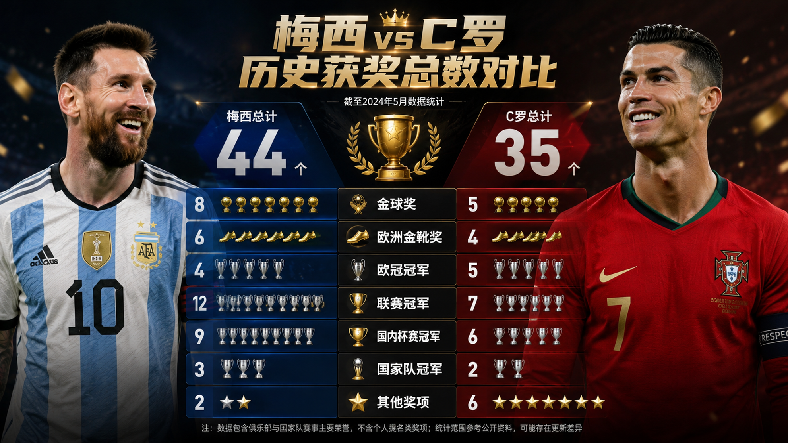
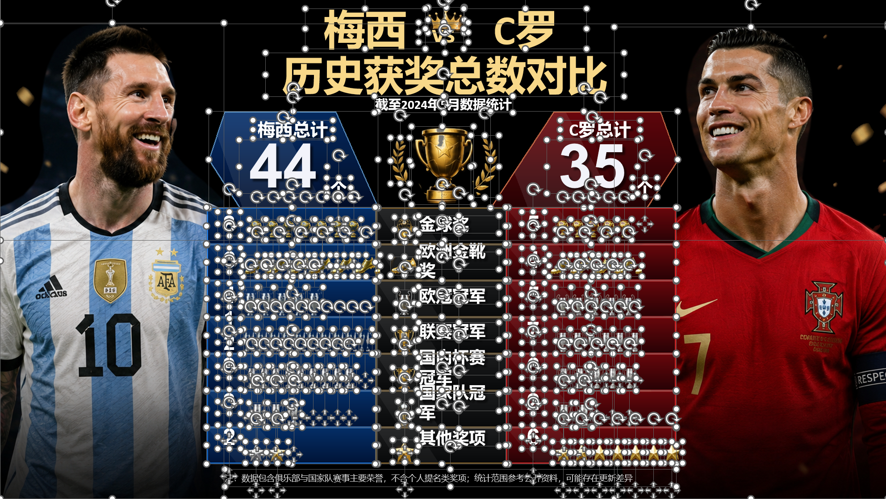

适用于网页版的图片转可编辑PPT提示词

原理：将每张图片的视觉原始拆分成独立的图片，文字拆分成可编辑文本框

以下示例使用网页ChatGPT 5.5 High(耗时约30分钟，与图片复杂度有关)，只针对图片，没试过PDF,图片版PPT的转换效果

实测下来下列Prompt效果最好，实践中可按步发给AI，合并Prompt发现效果下降

## 网页转换效果示例：

|                             原图                             |                       转换后可编辑效果                       |
| :----------------------------------------------------------: | :----------------------------------------------------------: |
|  |  |

------

## Prompt 1:

请将这张<...................>图片进行拆分处理。要求:
1.如果一次无法全部生成，请分批输出，直到所有页面元素拆分完成。
2将每一页中的所有视觉元素拆分为单独 PNG图像。
3.每一个视觉元素单独输出一张 PNG。
4.保持所有元素在原页面中的相对位置、比例和尺寸关系。
5.每个 PNG 图片不要有背景，保持透明底。
6.不要合并元素，每个素材独立输出。
7.不需要任何文字内容。
8.直接输出图片，不要打包成文件夹。

------

## Prompt 2 :

请使用刚才拆分得到的所有PNG 素材，重新还原一套完整的PPT文件。
要求:
1.按照原始页面布局，将所有 PNG 素材放回对应位置。
2.所有图片保持原比例和原位置关系，不要擅自移动、拉伸或修改。
3.在此基础上，加入可编辑文本框。
4.文本必须是独立可编辑内容，不要做成图片。
5.整体输出为一个可编辑的PPT 文件，格式为.pptx。
6.最终文件需要可以直接修改文字、调整布局。

------

# English Version

Prompt for converting images into editable PowerPoint presentations on the web

Principle: Separate the original visual elements in each image into independent images, and convert the text into editable text boxes.

The example below uses ChatGPT 5.5 High on the web (taking about 30 minutes, depending on image complexity). It has only been tested with images; the conversion results for PDFs and image-based PowerPoint files have not been tested.

In testing, the following prompts produced the best results. In practice, send them to the AI one step at a time; combining them into a single prompt reduced the quality.

## Web Conversion Example:

|                        Original Image                        |                    Editable Result After Conversion                    |
| :----------------------------------------------------------: | :--------------------------------------------------------------------: |
|  |  |

------

## Prompt 1:

Please split this <...................> image into separate elements. Requirements:
1. If everything cannot be generated in a single response, output the results in batches until all page elements have been separated.
2. Extract every visual element on each page as a separate PNG image.
3. Output each visual element as its own PNG image.
4. Preserve the relative position, proportions, and size relationships of all elements on the original page.
5. Each PNG image must have no background and must retain a transparent background.
6. Do not combine elements; output every asset independently.
7. No text content is needed.
8. Output the images directly; do not package them into a folder.

------

## Prompt 2:

Please use all the PNG assets separated in the previous step to recreate a complete PowerPoint file.
Requirements:
1. Place every PNG asset back in its corresponding position according to the original page layout.
2. Preserve the original proportions and positional relationships of all images. Do not move, stretch, or modify them without permission.
3. Add editable text boxes on this basis.
4. All text must remain independently editable and must not be converted into images.
5. Output the complete presentation as an editable `.pptx` file.
6. The final file must allow direct text editing and layout adjustments.
